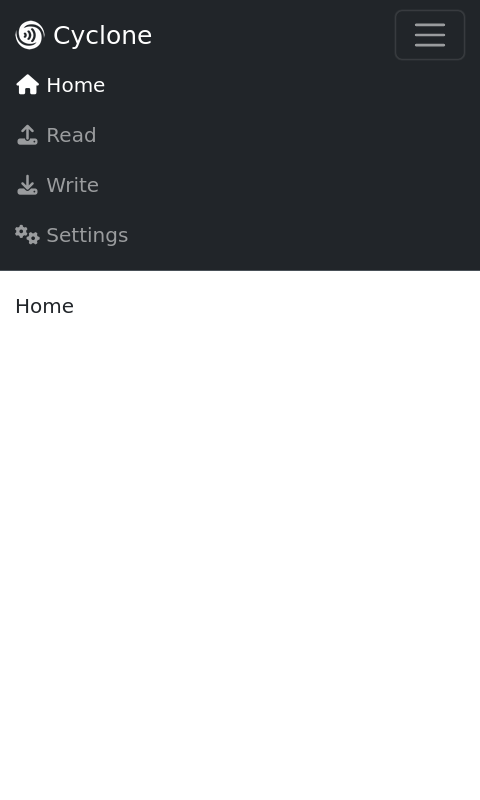
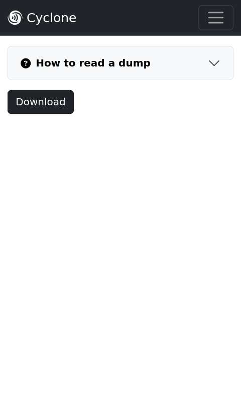
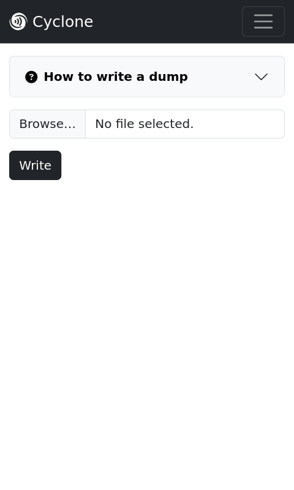
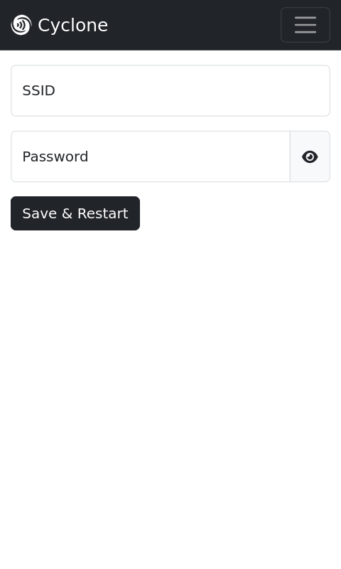
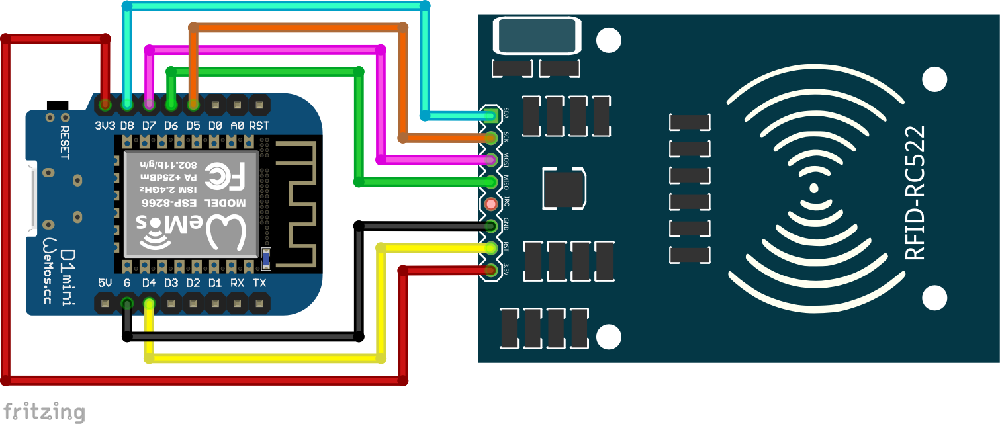

# Cyclone
Webbased reader/writer for mifare classic cards using ESP8266 (D1 mini) &amp; MFRC522

## Features
- read cards/toys with DEFAULT_KEY and toy keys
- write dumps to Magic cards (Gen 1)
- use Cyclone access point or connect to your local wifi network

## Screenshots of Cyclone Webinterface
**!!! Cyclone Webinterface currently lacks information texts !!!**
<details><summary>Home tab with expanded Navbar</summary>
 

</details>
<details><summary>Read tab: Read/download dump of current card</summary>
 

</details>
<details><summary>Write tab: Write dump to current card (only Magic cards / Gen 1)</summary>
 

</details>
<details><summary>Settings tab: Connect Cyclone to your local wifi network</summary>
 

</details>

## Wiring ESP8266 (D1 mini) and MFRC522 
| ESP8266 (D1 mini) | MFRC522 |
| -------- | ------- |
| D4 | RST |
| D5 | SCK |
| D6 | MISO |
| D7 | MOSI |
| D8 | SDA |
| 3V3 | 3.3V |
| G | GND |




## Flashing the firmware
1. Connect ESP8266 (D1 mini) to your computer via USB
2. Go to https://espressif.github.io/esptool-js/ using Chrome or Edge (Firefox does not support WebSerial)
3. Select Baudrate `921600` below **Program**
4. Click `Connect` button
5. Select serial port of connected ESP8266 (D1 mini)
6. Wait until connection process is completed
<details><summary>Output should look like:</summary>

 ```
esptool.js
Serial port WebSerial VendorID 0xXXXX ProductID 0xXXXX
Connecting....
Detecting chip type... ESP8266
Chip is ESP8266EX
Features: WiFi
Crystal is 26MHz
MAC: xx:xx:xx:xx:xx:xx
Uploading stub...
Running stub...
Stub running...
Changing baudrate to 921600
Changed
```
</details>

7. Change Flash Address to `0x0`
8. Choose File `Cyclone_vX.Y.Z.bin`
9. Click `Program` button
10. Wait until flashing process is completed
<details><summary>Output should look like:</summary>

 ```
Warning: Image file at 0x0 doesn't look like an image file, so not changing any flash settings.
Compressed 4169728 bytes to 761690...
Writing at 0x0... (2%)
Writing at 0x5cee... (4%)
Writing at 0xbb8e... (6%)
Writing at 0x11981... (8%)
Writing at 0x17290... (10%)
Writing at 0x1d06e... (12%)
Writing at 0x22494... (14%)
Writing at 0x27cfa... (17%)
Writing at 0x2d0bd... (19%)
Writing at 0x32089... (21%)
Writing at 0x37174... (23%)
Writing at 0x3c97c... (25%)
Writing at 0x4202d... (27%)
Writing at 0x47417... (29%)
Writing at 0x4ca51... (31%)
Writing at 0x53209... (34%)
Writing at 0x58b49... (36%)
Writing at 0x303768... (38%)
Writing at 0x308f0a... (40%)
Writing at 0x30f00b... (42%)
Writing at 0x314bf3... (44%)
Writing at 0x31a927... (46%)
Writing at 0x3204a9... (48%)
Writing at 0x325d7e... (51%)
Writing at 0x32dde8... (53%)
Writing at 0x337744... (55%)
Writing at 0x33fbd5... (57%)
Writing at 0x349541... (59%)
Writing at 0x352d35... (61%)
Writing at 0x35cf77... (63%)
Writing at 0x367911... (65%)
Writing at 0x371b1b... (68%)
Writing at 0x37a54d... (70%)
Writing at 0x382fdc... (72%)
Writing at 0x38bbf1... (74%)
Writing at 0x394707... (76%)
Writing at 0x39cb42... (78%)
Writing at 0x3a5547... (80%)
Writing at 0x3ad9b5... (82%)
Writing at 0x3b58fa... (85%)
Writing at 0x3bdbcd... (87%)
Writing at 0x3c64f9... (89%)
Writing at 0x3d48bb... (91%)
Writing at 0x3e0bbe... (93%)
Writing at 0x3ea420... (95%)
Writing at 0x3f0b8b... (97%)
Writing at 0x3f6abf... (100%)
Wrote 4169728 bytes (761690 compressed) at 0x0 in 29.295 seconds.
Hash of data verified.
Leaving...
```
</details>

11. Click `Disconnect` button
12. Click `Start` below **Console**
13. Select serial port of connected ESP8266 (D1 mini)
14. Click `Reset` below **Console**
<details><summary>Output should look like:</summary>

```
Started!
Failed to open config file: /config.json
Setting AP (Access Point)…
AP IP address: 192.168.4.1
```
</details>

15. Flashing is now completed and the ESP8266 creates its own Access Point
16. Connect to the Cyclone Webinterface...

## Connecting to the Cyclone Webinterface
1. Connect to `Cyclone` AP using password `12345678`
2. Open your favorite browser and go to `http://192.168.4.1`
3. Cyclone Webinterface should show up now

## Connect Cyclone to your local wifi network
1. Open Cyclone Webinterface
2. Click `Settings` tab
3. Enter `SSID` and `Password` of your local wifi network
4. Click `Save & Restart` button
5. A green popup appears `Settings saved successfully. Restarting...`
6. Cyclone now restarts and connects to your local wifi network
7. Open Cyclone Webinterface using the IP given by your local wifi network
